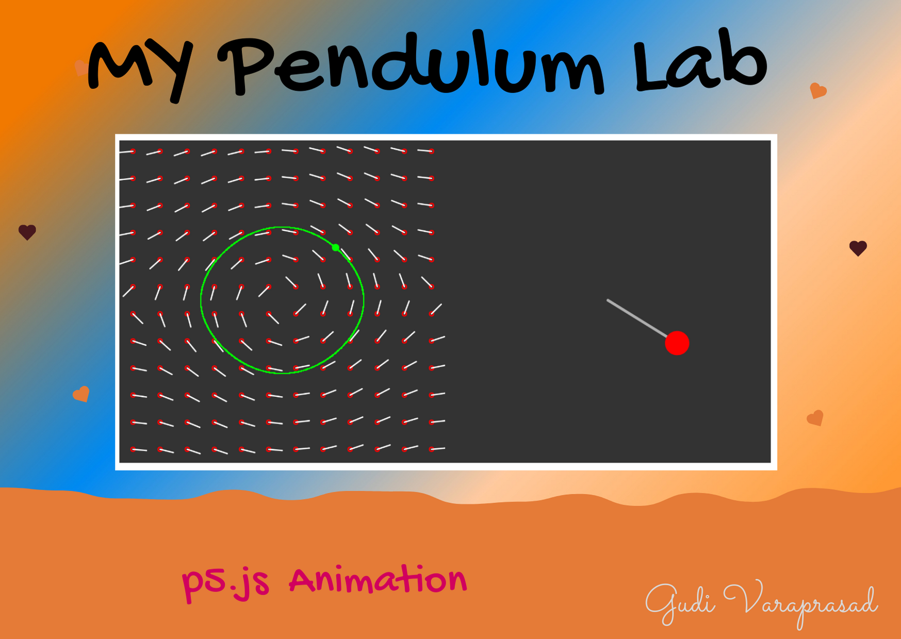

## Project Title : My Pendulum Lab - Visualizing Direction Field of a Bob

## Abstract of the project: 

In this project, I will be implementing the project as a web application which will help the user to understand the concept of Direction Field of a Simple Pendulum. 
The concept used is, when a user clicks in the area of direction vectors, based on that the speed of the pendulum bob is visualized. 
The conclusion of this animation is, the more is the direction vectors, the more is the speed of the bob. 
This is implemented using p5.js, Vectors, simple Geometry, and basic 3D and 2D Transformations. A complete website with this conceptual animation will be developed. 

## Project Demo :
### https://gudivaraprasad.github.io/ComputerGraphics/p5js/My_Pendulum_Lab/index.html

[Get Source Code !](https://github.com/GudiVaraprasad/ComputerGraphics/tree/master/p5js/My_Pendulum_Lab)

© *2020 Gudi Varaprasad | All rights reserved.*
